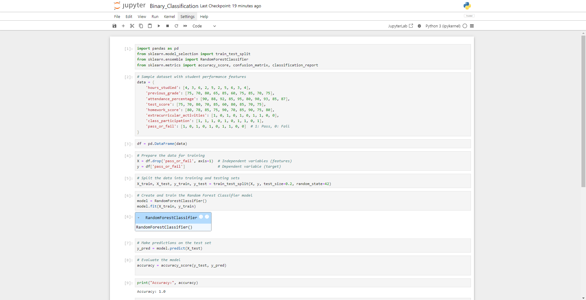
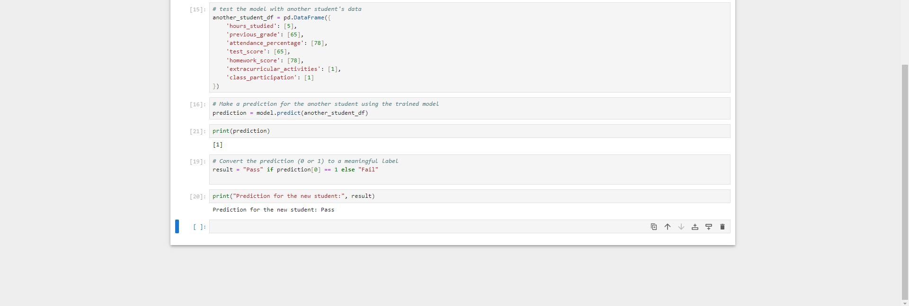

# Machine_Learning--Supervised_Learning--Binary_Classification

Machine Learning (ML) is a type of Artificial Intelligence (AI) that allows software applications or programs to become more accurate in predicting outcomes without being explicitly programmed to do so. Machine Learning algorithms use historical data as input to predict new output values.

   Supervised learning is a type of Machine Learning of training a computer on a set of **labeled data**. This means that the data has been pre-classified, so the model knows what the correct output should be for each input.

  Binary classification is a task where the model is only trained to predict one of two categories, for example, a binary classification model could be used to predict whether a student will pass or fail.

## Lets dive into action
  We will use the RandomForestClassifier algorithm to build the classification model. It trains on the features such as 'hours_studied', 'previous_grade', 'attendance_percentage', 'test_score', 'homework_score', 'extracurricular_activities', and 'class_participation' to predict whether a student will pass or fail. The model will then be evaluated using accuracy.

  Finally, we shall create another student's data(*another_student_df*) who studied for 5 hours, had a previous grade of 65, an attendance percentage of 78, test score of 65, homework score of 78, and participated in extracurricular_activities (1) class discussions (1). This is for testing the model.

  Here is a code snippet of the binary classification model that classifies whether a student will pass or fail. Play around with the *another_student_df* to test and see the changes.

  ```python
import pandas as pd
from sklearn.model_selection import train_test_split
from sklearn.ensemble import RandomForestClassifier
from sklearn.metrics import accuracy_score, confusion_matrix, classification_report

# Sample dataset with student performance features
data = {
    'hours_studied': [4, 3, 6, 2, 5, 2, 5, 6, 3, 4],
    'previous_grade': [75, 70, 80, 65, 85, 60, 75, 85, 70, 75],
    'attendance_percentage': [90, 88, 92, 85, 95, 80, 90, 93, 85, 87],
    'test_score': [75, 70, 80, 70, 85, 60, 80, 85, 70, 75],
    'homework_score': [80, 78, 85, 75, 90, 70, 85, 90, 75, 80],
    'extracurricular_activities': [1, 0, 1, 0, 1, 0, 1, 1, 0, 0], # 1: Yes, 0: No
    'class_participation': [1, 1, 1, 0, 1, 0, 1, 1, 0, 1], # 1: Yes, 0: No
    'pass_or_fail': [1, 0, 1, 0, 1, 0, 1, 1, 0, 0]  # 1: Pass, 0: Fail
}

df = pd.DataFrame(data)

# Prepare the data for training
X = df.drop('pass_or_fail', axis=1)  # Independent variables (features)
y = df['pass_or_fail']               # Dependent variable (target)

# Split the data into training and testing sets
X_train, X_test, y_train, y_test = train_test_split(X, y, test_size=0.2, random_state=42)

# Create and train the Random Forest Classifier model
model = RandomForestClassifier()
model.fit(X_train, y_train)

# Make predictions on the test set
y_pred = model.predict(X_test)

# Evaluate the model
accuracy = accuracy_score(y_test, y_pred)

print("Accuracy:", accuracy)


# test the model with another student's data
another_student_df = pd.DataFrame({
    'hours_studied': [5],
    'previous_grade': [65],
    'attendance_percentage': [78],
    'test_score': [65],
    'homework_score': [78],
    'extracurricular_activities': [1],
    'class_participation': [1]
})

# Make a prediction for another student using the trained model
prediction = model.predict(another_student_df)

# Convert the prediction (0 or 1) to a meaningful label
result = "Pass" if prediction[0] == 1 else "Fail"

print("Prediction for the new student:", result)

```
Personally, I shall run the code in **Jupyter Notebook**.


